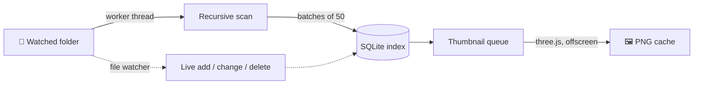

<p align="center">
  
</p>

<h1 align="center">MeshPit</h1>

<p align="center">
  <b>A local library for every 3D-printable file on your machine.</b><br/>
  Point it at a folder, walk away, and come back to a searchable, thumbnailed gallery.
</p>

<p align="center">
  
  
  
  
</p>
<p align="center">
If you find my work useful or helpful I am always up for a coffee!

<a href="https://www.buymeacoffee.com/moronicgeek" target="_blank"></a>

</p>
<p align="center">
  
</p>

---

## Why?

If you print, you hoard. A few hundred downloads later your models are scattered across
`Downloads`, half of them are called `files.stl`, and the only way to find the one you want is to
open them in a slicer one at a time.

MeshPit indexes your models **where they already live** — nothing is imported, copied or moved. It
walks the folders you choose, renders a preview of every model it finds, and puts the whole lot
behind a search box.

## Highlights

| | |
|---|---|
| 🗂️ **Nothing gets moved** | Your folder structure stays exactly as it is. MeshPit only keeps an index. |
| 🖼️ **Real previews** | Every STL, OBJ, 3MF and STEP file is rendered to a thumbnail — including the colour preview your slicer embedded in a 3MF. |
| 🔍 **Instant search** | Filter 10,000 files by name as you type, then sort by name, size, date added or date modified. |
| 🏷️ **Tags & collections** | Freeform tags for "articulated", "gift", "petg"; collections to group a set of models under one name. |
| 📓 **Projects** | A workspace per build: a Markdown readme, the models it uses, reference photos, and links back to the Onshape or Tinkercad document the parts came from. |
| 🧬 **Duplicate finder** | Byte-for-byte duplicate detection via SHA-256, with a one-click cleanup. |
| 💡 **Lithophane maker** | Turn a photo into a print that shows the picture when lit from behind, plus a light box to hold it. Free on the desktop and [on the web](https://meshpit.onrender.com/lithophane). |
| 🩹 **Mesh repair** | Find and fix holes, non-manifold geometry, flipped normals and other errors that stop an STL or OBJ from printing. Free on the desktop and [on the web](https://meshpit.onrender.com/repair). |
| 🖨️ **Straight to the slicer** | Double-click any model to open it in Bambu Studio (or your system default). |
| 🌙 **Stays out of the way** | Scanning runs on a low-priority background thread, so indexing 10,000 files doesn't cost you a frame. |

---

## How indexing works

Indexing is the part of MeshPit you should never have to think about, so here is what it's doing
while you don't.



### 1. Discovery — the background walk

When you add a folder, MeshPit spawns a **`worker_thread`** to walk it recursively. The walk never
touches the UI thread, and it deliberately plays nice:

- it **yields to the event loop** regularly so the worker never hogs its thread,
- it pauses every 25 directory entries to let other work through,
- results are streamed back in **batches of 50** files, so the gallery fills in as the scan runs
  instead of appearing all at once at the end,
- **symlink loops** are broken by resolving real paths and tracking visited directories,
- hidden folders (`.git`, `.cache`, …) and `node_modules` are skipped.

Recognised extensions: **`.stl`**, **`.obj`**, **`.3mf`**, **`.step`**, **`.stp`**.

### 2. The index — one small SQLite file

Each file found becomes a row in a local SQLite database (WAL mode, so reads never block the scan).

| Recorded | Used for |
|---|---|
| Absolute path | Opening, revealing, and de-duplicating — it's the unique key |
| File name & extension | Search and the type badge on each card |
| Size in bytes | Sorting, and the first pass of duplicate detection |
| Modified time | "Recently modified" sort, and detecting edits |
| Date added | "Recently added" sort |
| Thumbnail path & status | The gallery grid |
| Tags, collections & projects | Your own organisation, never touched by a rescan |

Rows are keyed on path, so **rescanning is idempotent** — a folder you've scanned a hundred times
produces the same index, and your tags, collections and projects survive every one of them.

### 3. Thumbnails — rendered once, cached forever

Files with a `pending` thumbnail are queued and rendered **one at a time** in a hidden offscreen
Electron window, so the GPU work can't stutter the gallery you're scrolling:

- **STL / OBJ** — parsed with three.js, auto-framed, and rendered to a PNG.
- **3MF** — if your slicer embedded a plate preview (Bambu Studio, Orca, PrusaSlicer all do),
  MeshPit lifts that image straight out of the archive, which is why so many previews come out in
  full colour. If there isn't one, the mesh is rendered instead.
- **STEP / STP** — triangulated through OpenCascade (`occt-import-js`, WASM), preserving per-solid
  colours.

Renders are written to disk as PNGs and reused forever after. Thumbnail resolution is configurable
(160px / 320px / 512px) in **Settings**.

### 4. Staying in sync

| Event | What MeshPit does |
|---|---|
| A file is added to a watched folder | Picked up live by the file watcher and indexed immediately |
| A file is modified | Size and mtime update, and its thumbnail is re-rendered |
| A file is deleted or moved away | Dropped from the index |
| A file has vanished since the last scan | Flagged as *missing* and hidden from the gallery — its tags, collections and project membership are kept, in case the drive comes back |
| You hit **Rescan All** | Every watched folder is re-walked from scratch |

### 5. Duplicate detection

`Find Duplicates` is a two-pass check, so it stays fast on large libraries:

1. **Group by size** in SQL — files with a unique byte count can't be duplicates, so they're never
   read from disk.
2. **Hash the survivors** with SHA-256 and group by digest, giving byte-for-byte certainty rather
   than a filename guess.

You get one group per set of identical files, with the first copy marked *Keep* and the rest
pre-ticked for deletion — so cleaning up 53 redundant copies is one click.

<p align="center">
  
</p>

---

## Projects

Tags and collections answer *"where is that model?"*. A **project** answers the other question —
*"what was I building, and how did I print it last time?"*

A project is a workspace in the sidebar that holds everything about one build in a single place:
the models it uses, the notes you wrote, photos of the result, and links back to the CAD it came
from. Creating one is a name and nothing else; a project needs no folder on disk and owns no files.

### Readme

Every project opens on a **Markdown readme** with a Preview / Edit toggle. It starts from a skeleton
worth filling in rather than an empty box — Overview, Print settings, Assembly, To do — because the
thing you always wish you'd written down is which nozzle temperature actually worked.

Edits **autosave** 600 ms after you stop typing, and flush again when you switch tabs or projects,
so there is no save button to forget. Links in the rendered readme open in your browser rather than
inside the app.

Edit mode carries a formatting toolbar, so none of the Markdown has to be memorised:

| Group | Controls |
|---|---|
| Headings | H1, H2, H3 — applied per line, and swapping level never stacks hashes |
| Text | Bold (<kbd>⌘B</kbd>), italic (<kbd>⌘I</kbd>), strikethrough, inline code |
| Lists | Bullets, numbers, task checkboxes, block quote |
| Insert | Link (<kbd>⌘K</kbd>), image, code block, table, horizontal rule |
| Text size | A− / A+, from 11 to 22 px, applied to both the editor and the preview and remembered |

Every control is a **toggle** — pressing Bold on bold text unbolds it, and a second press of H2 on a
heading turns it back into a paragraph. With nothing selected they drop in a placeholder and select
it, so you can type straight over the top.

**Image** copies the file you pick into the project's asset folder, the same place reference images
go, and drops the Markdown in at the caret. Pictures added this way show up in the readme itself
rather than in the References tab — that stays a curated gallery rather than a dump of everything
the notes mention.

### Models

The **Models** tab is the normal gallery, filtered to that project and with its own search box.

- **+ Add models** opens a searchable picker over your whole library.
- Selecting models in the grid offers **Remove from project**.
- You can also attach the current selection from the details panel anywhere in the app — it has a
  *Projects* list with the same checkboxes as collections.

Attaching a model **copies and moves nothing**, exactly like the rest of MeshPit: a project records
which rows of the index belong to it, and a file can sit in as many projects as you like. Removing a
model from a project — or deleting the project outright — never touches the file on disk.

### References

The **References** tab is for everything that isn't a mesh.

| | |
|---|---|
| 🖼️ **Reference images** | Sketches, photos of the printed part, screenshots of the CAD. Add them through the file picker; each gets an editable caption and opens full-size on click. |
| 🔗 **Links** | The Onshape document a part was modelled in, the Tinkercad sketch it started as, the listing you downloaded it from. |

Reference images are **copied into MeshPit's own storage** rather than indexed where they sit — this
is the one place MeshPit keeps its own copy of something, so that a screenshot still works after you
empty `Downloads`.

Links are tidied up as you add them: a pasted `cad.onshape.com/documents/…` is normalised to `https`
and badged **Onshape** or **Tinkercad** automatically from its hostname. Anything that isn't an
`http`/`https` URL is refused, and clicking a link hands it to your browser rather than opening it
inside the app window.

---

## Lithophane maker

A lithophane is a thin plate whose thickness follows a photo. Dark areas print thick and block
light, and bright areas print thin and let it through. With a light behind it, the plate shows the
photo.

**Tools → 🖼️ Lithophane** in the desktop app, or [meshpit.onrender.com/lithophane](https://meshpit.onrender.com/lithophane)
in a browser, turns a JPEG, PNG or WebP into one. It is free in both places and needs no license
or account. The STL is built on your own computer, so the photo is never uploaded.

| Setting | What it does |
|---|---|
| Outline | Rectangle, round, hexagon, octagon, triangle or heart. The shapes match the Project Box's. A rectangle takes the photo's proportions; the others keep their own and crop the photo to fill them. |
| Photo | Zoom and move the photo to choose which part shows inside the outline. |
| Size | Width (the height follows the photo or the outline), a solid frame that follows the outline, and the mesh detail from 0.1 to 0.5 mm. |
| Thickness | The thinnest point (white), the thickest point (black), and the frame's thickness. |
| Tone | Brightness, contrast and gamma, a negative, and a mirror for viewing from the flat side. |
| Shape | Flat, or curved up to 270°. Flat ones export standing up or lying down; curved ones always stand. |

The preview has a **Lit from behind** mode that estimates how much light gets through each point,
so you can tune the tone before printing. Very large prints get a coarser mesh so the STL stays a
size slicers can open, and the view says when that happens.

### Light box

A lithophane needs a light behind it. Tick **Make a box that lights it from behind** and MeshPit
builds a box around the print, which you export as its own STL. The box follows the
lithophane's outline, so a heart gets a heart-shaped box and a round one a round box.

- The lithophane slides in through a slot in the top and stands behind a front frame. The frame's
  lip covers the lithophane's border.
- Behind it is an empty chamber for the light to spread in, with rails on the back wall for an LED
  strip. You set the strip width and up to four rows.
- The strip's cord leaves through a hole in the back. It can be round or slot-shaped, for a flat
  plug like USB, and you set its size, its distance from the centre and its height.
- A shaped lithophane slides straight down into its slot and comes to rest on the bottom of its
  outline: a heart on its point, a round one in a cradle. Round and heart boxes stand on a flat
  foot.
- **Round corners** rounds every outside edge of a rectangular box, up to the wall thickness.
- A curved rectangular lithophane gets a box bent to the same curve. A curved lithophane of any
  other outline has no box yet; make it flat to get one. That box prints standing up, with a
  separate lid over the light chamber that lifts off to fit the strip. A flat lithophane's box
  prints lying on its back. Neither needs supports.

If a setting doesn't fit, for example a cord hole too big for the back wall or a curve too tight
for a deep box, MeshPit adjusts it and says what changed.

The generator lives in two packages with no desktop code in them: `@meshpit/lithophane-core`
(the photo, the meshes and the STL writer, in plain TypeScript) and `@meshpit/lithophane-ui` (the
React view and 3D preview). `npm run verify:litho` checks that every lithophane and light box it
builds is a closed, printable solid.

---

## Mesh repair

**Tools → 🩹 Mesh Repair** in the desktop app, or [meshpit.onrender.com/repair](https://meshpit.onrender.com/repair)
in a browser, opens an STL or OBJ file, lists what is wrong with it and fixes it. In the desktop
library, **Repair Mesh** in a model's details opens it straight in the tool, and the repaired copy
saves beside the original. It is free in both places and needs no license or account. The model is
read and repaired on your own computer and is never uploaded.

| Problem | What the repair does |
|---|---|
| Duplicate vertices | Welds corners closer than the weld distance, which closes the cracks between them. The distance is 1/100,000 of the model's diagonal unless you set one. |
| Degenerate triangles | Removes triangles with no area. A flat sliver along an edge splits its neighbour at the sliver's corner instead, so no gap opens. |
| Duplicate triangles | Removes repeated copies. Two copies wound opposite ways form a wall with no inside and both go. |
| Non-manifold edges and vertices | Sorts the triangles round an edge by angle and pairs them, then gives each fan of triangles its own copy of the vertex. Two cubes touching along an edge become two closed cubes. |
| Flipped triangles | Turns triangles to match the rest of their shell. |
| Holes | Closes each open boundary with triangles, cut by ear clipping on the hole's best-fit plane. |
| Inside-out shells | Turns a closed shell the right way out, unless another shell encloses it, since a hollow's inner wall should face in. |
| Self-intersections | Cuts out triangles that pass through their own shell, with the triangles round them, and closes the gap. Separate parts that overlap are left alone, because slicers merge them. |

Each repair can be turned off. The preview switches between the original and the repair and marks
open edges, non-manifold edges and self-intersections, and shows the inside of the surface in dark
red, so flipped triangles and holes stand out. The repair runs in a background worker, so a large
model doesn't freeze the window. Export saves an STL or an OBJ.

The engine lives in `@meshpit/mesh-repair-core` (plain TypeScript) and the view in
`@meshpit/mesh-repair-ui`. `npm run verify:repair` breaks test meshes in each of the ways above and
checks the repair leaves them closed, manifold and facing outwards.

---

## A look around

**Details panel** — preview, full path, size and dates, tags, collections, and one-click actions.

<p align="center">
  
</p>

**Collections** — group models by project; a file can live in as many as you like.

<p align="center">
  
</p>

---

## Getting started

```bash
npm install
npm run dev        # run in development
npm run build      # production build → out/
npm run dist:mac   # package a .dmg   (also: dist:win, dist:linux)
```

Then:

1. **+ Add Folder** — pick a directory. The first scan starts immediately and thumbnails fill in
   behind it.
2. **Settings** — point MeshPit at your Bambu Studio install to enable one-click opening. Without
   it, models open in whatever your OS uses by default.
3. **+ New Project** — when you start a build, give it a name and keep its models, notes, photos and
   CAD links together as you go.
4. Print something.

## Keyboard shortcuts

| Shortcut | Action |
|---|---|
| <kbd>⌘</kbd>/<kbd>Ctrl</kbd> + <kbd>F</kbd> | Jump to search |
| <kbd>⌘</kbd>/<kbd>Ctrl</kbd> + <kbd>↑↓←→</kbd> | Move and extend the selection |
| <kbd>Shift</kbd> + click | Select a range |
| <kbd>⌘</kbd>/<kbd>Ctrl</kbd> + click | Add or remove one file from the selection |
| Double-click | Open in Bambu Studio |
| <kbd>⌫</kbd> | Remove the selection from the library (files stay on disk) |
| <kbd>⌘</kbd>/<kbd>Ctrl</kbd> + <kbd>⌫</kbd> | Delete the selection from disk (with a confirmation) |
| <kbd>⌘</kbd>/<kbd>Ctrl</kbd> + <kbd>R</kbd> | Rename the selected file on disk |

## Where your data lives

Your models are never touched. MeshPit's own state is a single database, a thumbnail cache, and the
reference images you added to projects (under `project-assets/`):

| Platform | Location |
|---|---|
| macOS | `~/Library/Application Support/MeshPit/` |
| Windows | `%APPDATA%\MeshPit\` |
| Linux | `~/.config/MeshPit/` |

Delete that folder and you're back to a clean install — your files stay exactly where they were.

## Built with

- **Electron** + `electron-vite` + **React** + **TypeScript**
- **better-sqlite3** — the local index
- **three.js** — offscreen thumbnail rendering, and the 3D previews in the box designer, lithophane maker and mesh repair
- **occt-import-js** — STEP triangulation
- **chokidar** + Node `worker_threads` — live watching and background scanning
- **marked** + **DOMPurify** — project readme rendering, sanitised before display


## CAVEATS

Since I dont have an apple developer account you can run the following command on your command line to open the application: 
```
xattr -dr com.apple.quarantine /Applications/MeshPit.app 
```
